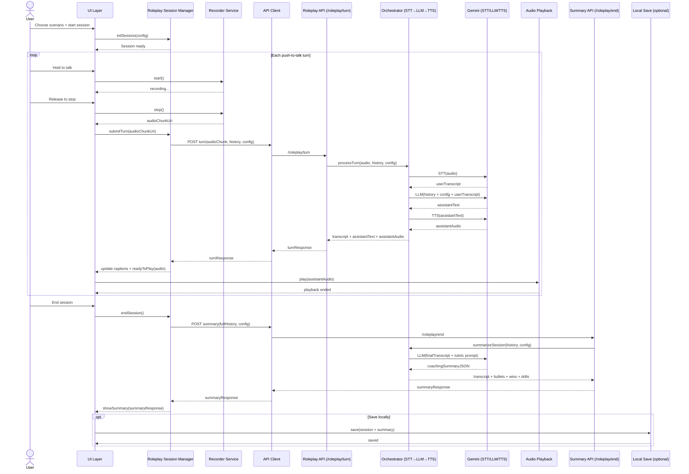
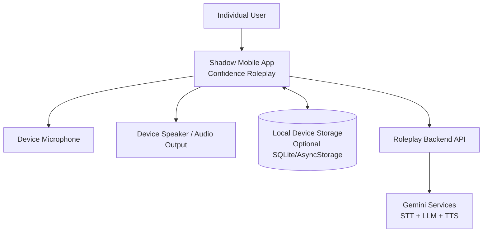

# Core System Diagrams for NEW architecture

## 1) Flow Diagram (Core User Flow)

```mermaid
flowchart TD
    A[Open app] --> D[Go to Home]

    D --> S[Choose roleplay scenario<br/>(Interview / Presentation / Hard conversation)]
    S --> C[Configure roleplay<br/>(role, tone, difficulty, goals)]

    C --> R[Start roleplay session]

    %% Turn loop (push-to-talk)
    R --> T{Push-to-talk?}
    T -- Hold --> U[Capture speech chunk]
    U --> V[Send audio turn to Roleplay API]
    V --> W{Turn success?}

    W -- Yes --> X[Receive: user transcript + AI text + AI voice]
    X --> Y[Play AI voice response]
    Y --> T

    W -- No --> Z[Show error + retry]
    Z --> T

    %% End session + coaching
    R --> E[End session]
    E --> F[Send full session transcript/history to Summary API]
    F --> G{Summary success?}
    G -- Yes --> H[Show coaching summary<br/>Transcript + wins + improvement bullets + drills]
    G -- No --> I[Show error + retry summary]
    I --> F

    %% Optional local save
    H --> J{Save session locally?}
    J -- Yes --> K[Save to device (SQLite or local storage)]
    J -- No --> L[Return to Home]
    K --> L
```

## 2) Component Diagram

```mermaid
flowchart LR
    U[User]

    subgraph APP[Shadow Confidence Builder App (Mobile)]
      UI[UI Layer<br/>Home, Scenario Setup, Roleplay Session, Summary]
      STATE[App State Layer<br/>Session State, History (optional), Settings]
      REC[Recorder Service<br/>Push-to-talk capture, chunk encoding]
      PLAYER[Audio Playback Service<br/>Play AI voice, pause/stop]
      ROLEPLAY[Roleplay Session Manager<br/>Turn loop, history buffer, retries]
      API[API Client<br/>Upload audio turn, request summary]
      LOCAL[(Local Persistence - Optional<br/>SQLite or AsyncStorage)]
    end

    subgraph BACKEND[Tiny Roleplay Backend API]
      TURN[Turn Endpoint<br/>POST /roleplay/turn]
      SUMMARY[Summary Endpoint<br/>POST /roleplay/end]
      ORCH[Orchestrator<br/>STT → LLM → TTS]
    end

    subgraph AI[Gemini Services]
      STT[Speech-to-Text]
      LLM[Roleplay LLM Response]
      TTS[Text-to-Speech]
    end

    U --> UI
    UI --> STATE
    UI --> REC
    UI --> PLAYER
    UI --> ROLEPLAY

    ROLEPLAY --> API
    API --> TURN
    API --> SUMMARY

    TURN --> ORCH
    SUMMARY --> ORCH

    ORCH --> STT
    ORCH --> LLM
    ORCH --> TTS

    STATE <--> LOCAL
    TURN --> API
    SUMMARY --> API
    API --> ROLEPLAY
    PLAYER --> UI
```

## 3) Sequence Diagram



## 4) System Context Diagram


