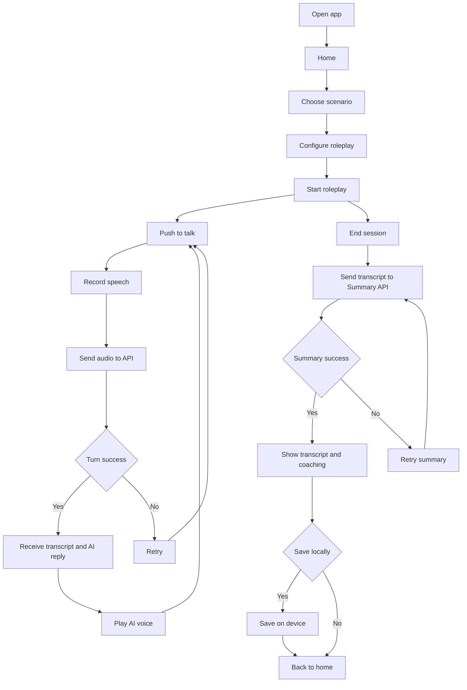
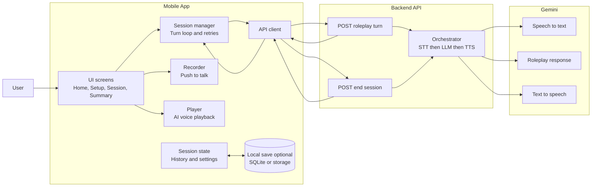
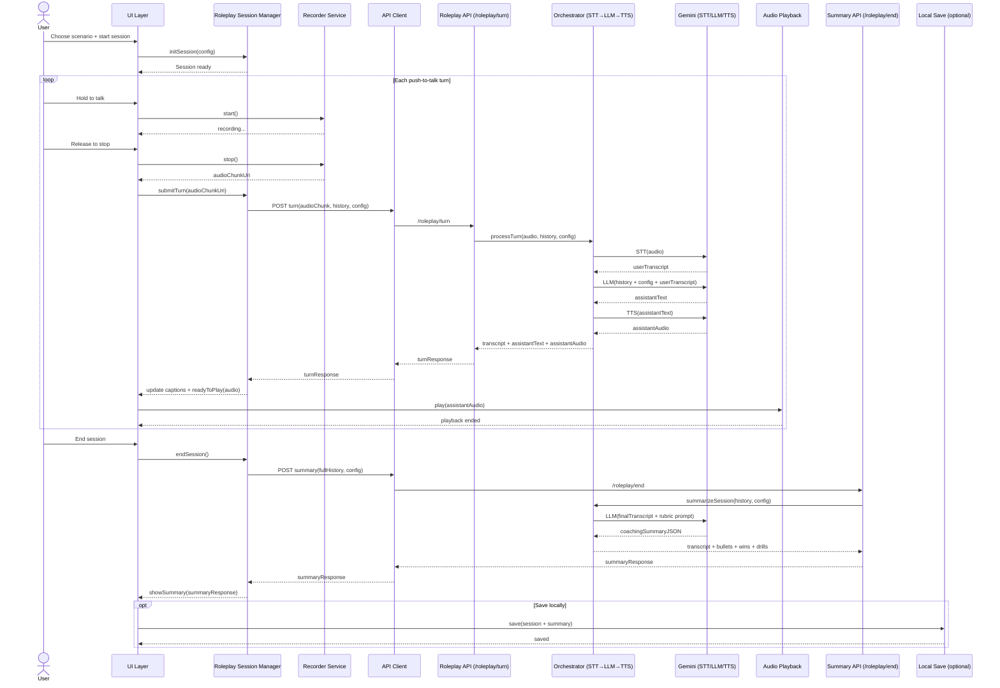
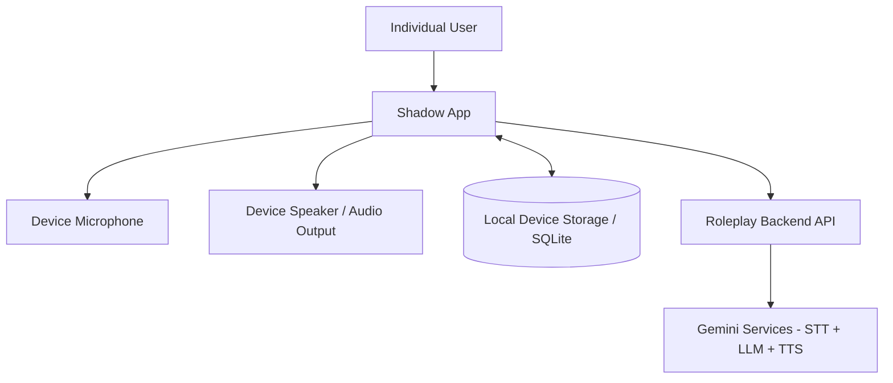

# Core System Diagrams for NEW architecture

## 1) Flow Diagram (Core User Flow)

```mermaid
flowchart TD
    A[Open app] --> B[Home]

    B --> C[Choose scenario]
    C --> D[Configure roleplay]
    D --> E[Start roleplay]

    E --> F[Push to talk]
    F --> G[Record speech]
    G --> H[Send audio to API]
    H --> I{Turn success}

    I -- Yes --> J[Receive transcript and AI reply]
    J --> K[Play AI voice]
    K --> F

    I -- No --> L[Retry]
    L --> F

    E --> M[End session]
    M --> N[Send transcript to Summary API]
    N --> O{Summary success}

    O -- Yes --> P[Show transcript and coaching]
    O -- No --> Q[Retry summary]
    Q --> N

    P --> R{Save locally}
    R -- Yes --> S[Save on device]
    R -- No --> T[Back to home]
    S --> T
```

## 2) Component Diagram

```mermaid
flowchart LR
    U[User]

    subgraph APP[Mobile App]
      UI[UI screens<br/>Home, Setup, Session, Summary]
      STATE[Session state<br/>History and settings]
      REC[Recorder<br/>Push to talk]
      PLAYER[Player<br/>AI voice playback]
      MGR[Session manager<br/>Turn loop and retries]
      CLIENT[API client]
      LOCAL[(Local save optional<br/>SQLite or storage)]
    end

    subgraph BACKEND[Backend API]
      TURN[POST roleplay turn]
      SUM[POST end session]
      ORCH[Orchestrator<br/>STT then LLM then TTS]
    end

    subgraph AI[Gemini]
      STT[Speech to text]
      LLM[Roleplay response]
      TTS[Text to speech]
    end

    U --> UI
    UI --> REC
    UI --> PLAYER
    UI --> MGR
    MGR --> CLIENT

    CLIENT --> TURN
    CLIENT --> SUM

    TURN --> ORCH
    SUM --> ORCH

    ORCH --> STT
    ORCH --> LLM
    ORCH --> TTS

    STATE <--> LOCAL
    TURN --> CLIENT
    SUM --> CLIENT
    CLIENT --> MGR
```

## 3) Sequence Diagram

```mermaid
sequenceDiagram
    actor U as User
    participant UI as UI Layer
    participant ROLE as Roleplay Session Manager
    participant REC as Recorder Service
    participant API as API Client
    participant TURN as Roleplay API (/roleplay/turn)
    participant ORCH as Orchestrator (STT→LLM→TTS)
    participant GEM as Gemini (STT/LLM/TTS)
    participant PLAY as Audio Playback
    participant SUM as Summary API (/roleplay/end)
    participant LOCAL as Local Save (optional)

    U->>UI: Choose scenario + start session
    UI->>ROLE: initSession(config)
    ROLE-->>UI: Session ready

    loop Each push-to-talk turn
        U->>UI: Hold to talk
        UI->>REC: start()
        REC-->>UI: recording...
        U->>UI: Release to stop
        UI->>REC: stop()
        REC-->>UI: audioChunkUri

        UI->>ROLE: submitTurn(audioChunkUri)
        ROLE->>API: POST turn(audioChunk, history, config)
        API->>TURN: /roleplay/turn

        TURN->>ORCH: processTurn(audio, history, config)
        ORCH->>GEM: STT(audio)
        GEM-->>ORCH: userTranscript
        ORCH->>GEM: LLM(history + config + userTranscript)
        GEM-->>ORCH: assistantText
        ORCH->>GEM: TTS(assistantText)
        GEM-->>ORCH: assistantAudio
        ORCH-->>TURN: transcript + assistantText + assistantAudio
        TURN-->>API: turnResponse
        API-->>ROLE: turnResponse
        ROLE-->>UI: update captions + readyToPlay(audio)
        UI->>PLAY: play(assistantAudio)
        PLAY-->>UI: playback ended
    end

    U->>UI: End session
    UI->>ROLE: endSession()
    ROLE->>API: POST summary(fullHistory, config)
    API->>SUM: /roleplay/end

    SUM->>ORCH: summarizeSession(history, config)
    ORCH->>GEM: LLM(finalTranscript + rubric prompt)
    GEM-->>ORCH: coachingSummaryJSON
    ORCH-->>SUM: transcript + bullets + wins + drills
    SUM-->>API: summaryResponse
    API-->>ROLE: summaryResponse
    ROLE-->>UI: showSummary(summaryResponse)

    opt Save locally
        UI->>LOCAL: save(session + summary)
        LOCAL-->>UI: saved
    end
```

## 4) System Context Diagram

```mermaid
flowchart TB
    USER[Individual User]
    APP[Shadow App]
    MIC[Device Microphone]
    SPK[Device Speaker / Audio Output]
    LOCAL[(Local Device Storage / SQLite)]
    ROLEAPI[Roleplay Backend API]
    GEMINI[Gemini Services - STT + LLM + TTS]

    USER --> APP
    APP --> MIC
    APP --> SPK
    APP <--> LOCAL
    APP --> ROLEAPI
    ROLEAPI --> GEMINI
```
