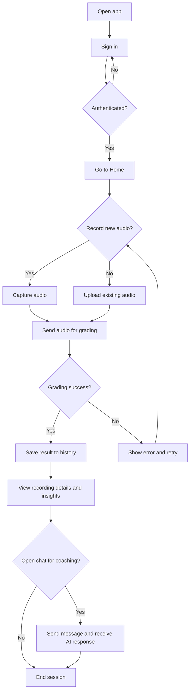
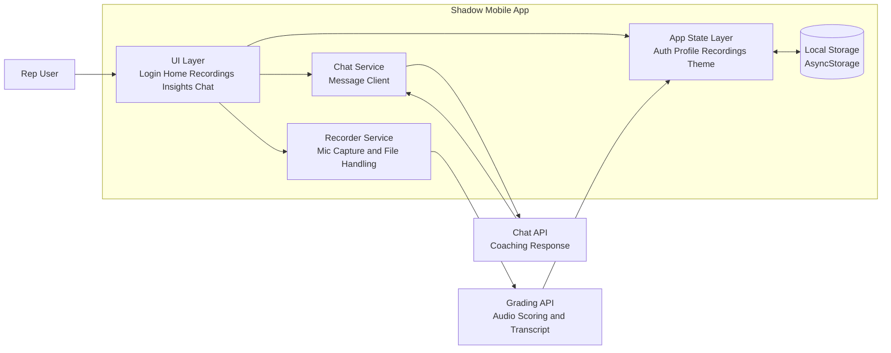
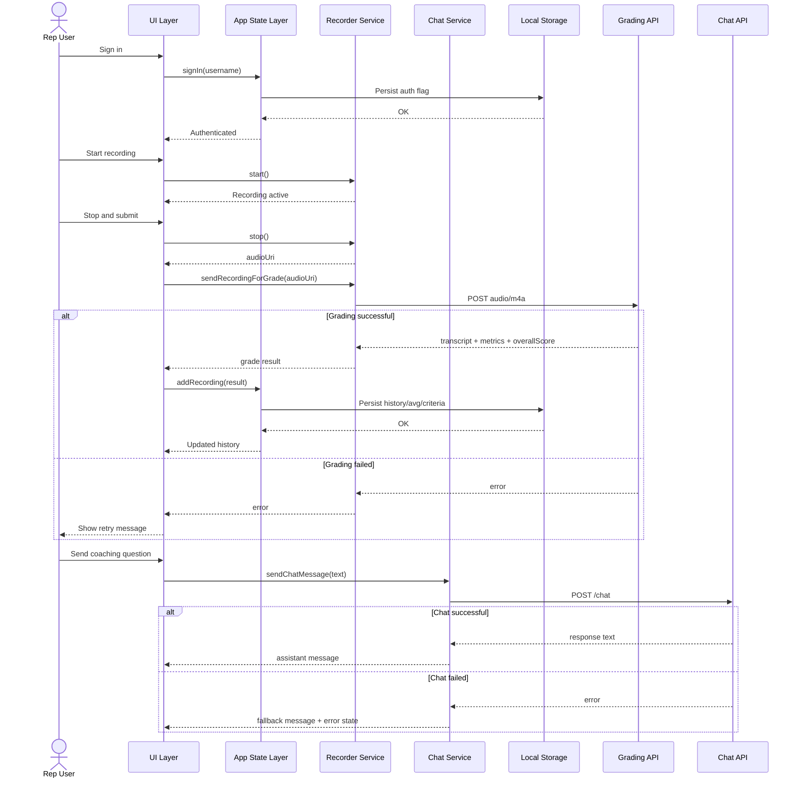
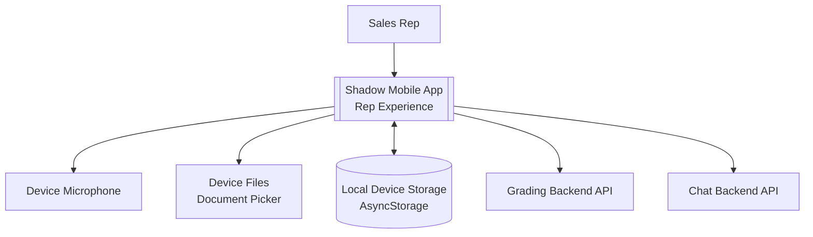

# Core System Diagrams (Rep App)

## 1) Flow Diagram (Core User Flow)

## 2) Component Diagram (Core Runtime Components)

## 3) Sequence Diagram (Same Components, Detailed Interaction)

## 4) System Context Diagram (Rep Scope)

